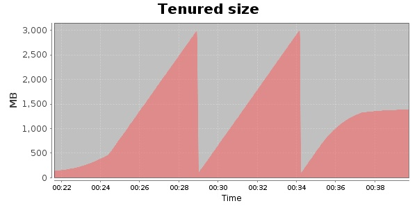
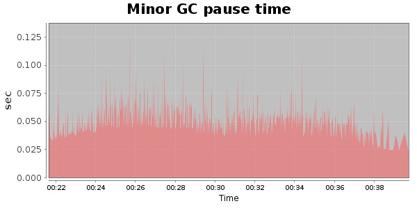
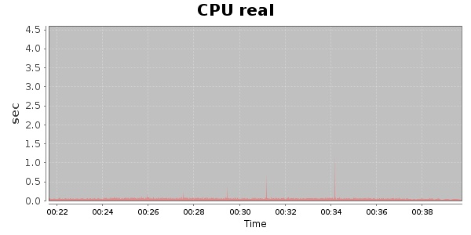
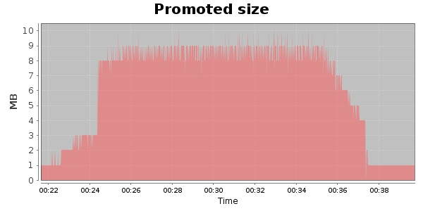
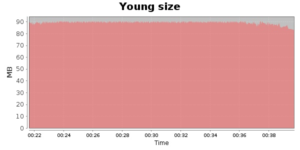

### Gatling-1.5.3 20000 Users
#### https://flood.io/bc59dd995fd8ff
#### Apdex 0.95 [4000]
This flood simulated up to 20,000 concurrent users for 18 minutes on  2013-10-02 00:21:00 UTC from Australia (Sydney). A mean response time of 1,710 ms was observed with a standard deviation of 19 ms. The 95th percentile was 1,782 ms and the 50th percentile (median) was 1,707 ms. A mean throughput of 1.10 Mbps was observed with a peak of 5.04 Mbps. A total of 157 MB was transferred. A total of 566,416 requests were successfully simulated with no errors observed. The mean request rate was 31,467.00 rpm. 

\
\
\
\
\

