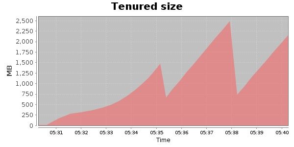
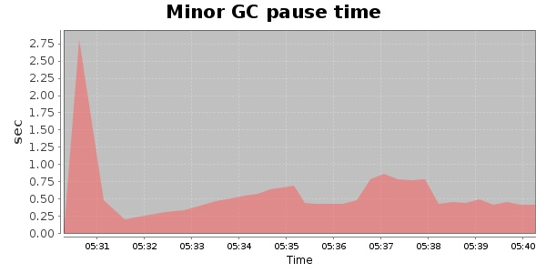
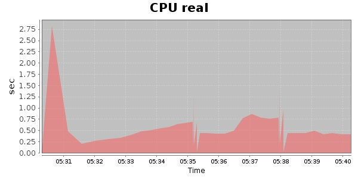
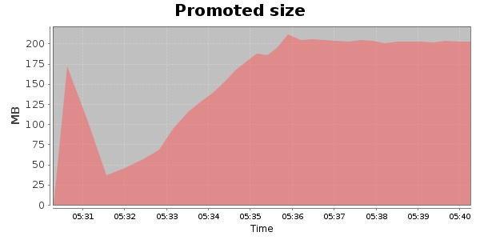
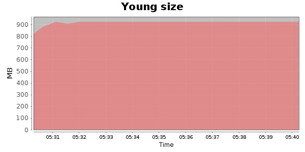

### JMeter-2.10 6000 Users
#### https://flood.io/bf55c072324b39
#### Apdex 0.8 [300]
This flood simulated up to 6,000 concurrent users for 9 minutes on  2013-09-30 05:31:00 UTC from Australia (Sydney). A mean response time of 309 ms was observed with a standard deviation of 4 ms. The 95th percentile was 318 ms and the 50th percentile (median) was 308 ms. A mean throughput of 1.46 Mbps was observed with a peak of 1.94 Mbps. A total of 109 MB was transferred. A total of 175,008 requests were successfully simulated with no errors observed. The mean request rate was 19,445.00 rpm. 

\
\
\
\
\

