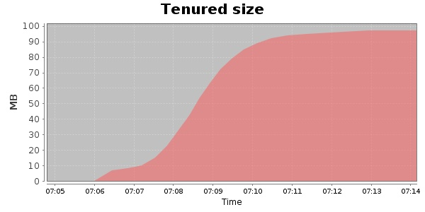
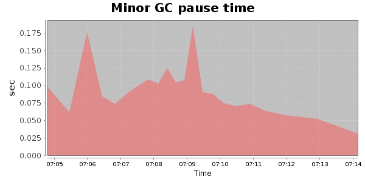
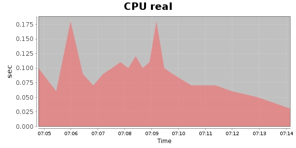
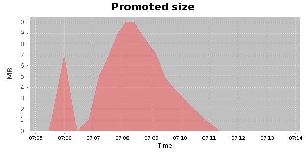
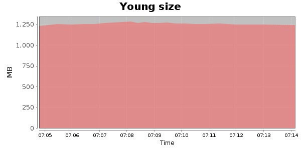

### Gatling-1.5.3 10000 Users
#### https://flood.io/c41ddfd118c7fb
#### Apdex 0.39 [1500]
This flood simulated up to 10,000 concurrent users for 10 minutes on  2013-09-30 07:03:00 UTC from Australia (Sydney). A mean response time of 1,733 ms was observed with a standard deviation of 84 ms. The 95th percentile was 1,984 ms and the 50th percentile (median) was 1,715 ms. A mean throughput of 1.17 Mbps was observed with a peak of 2.62 Mbps. A total of 96.4 MB was transferred. A total of 184,199 requests were successfully simulated with an error rate of 0.0% observed. The mean request rate was 18,420.00 rpm. 

\
\
\
\
\

