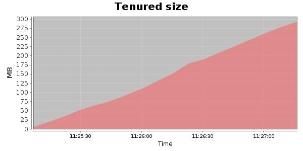
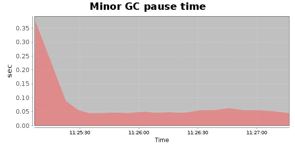
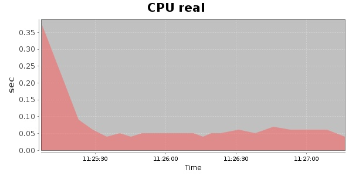
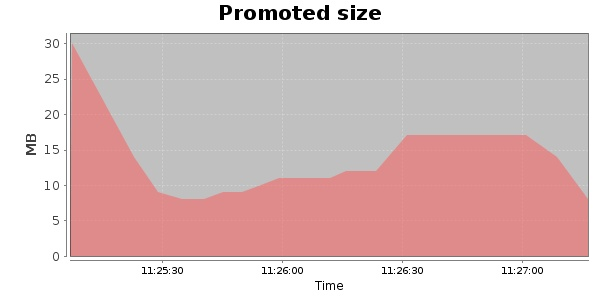
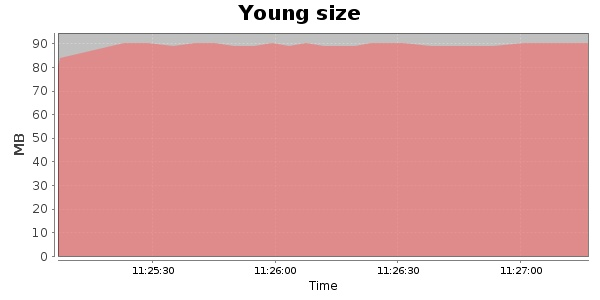

### JMeter-r1528295 1000 Users
#### https://flood.io/c475124fac6feb
#### Apdex 0.97 [4000]
This flood simulated up to 1,000 concurrent users for 2 minutes on  2013-10-02 11:25:00 UTC from Australia (Sydney). A mean response time of 1,094 ms was observed with a standard deviation of 908 ms. The 95th percentile was 1,662 ms and the 50th percentile (median) was 1,573 ms. A mean throughput of 101 kbps was observed with a peak of 208 kbps. A total of 2.21 MB was transferred. A total of 4,452 requests were successfully simulated with no errors observed. The mean request rate was 2,226.00 rpm. 

\
\
\
\
\

