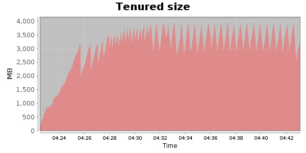
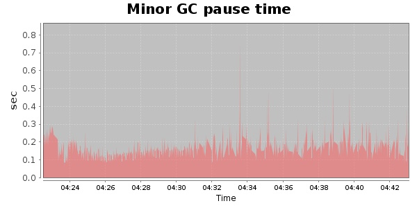
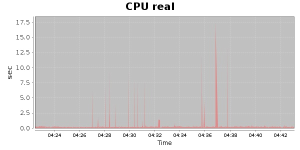
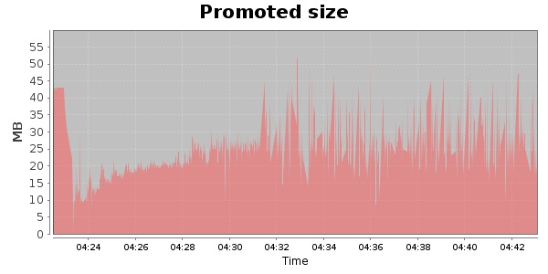
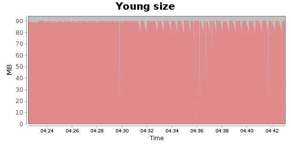

###  20000 Users
#### https://flood.io/cae0e7fce14dbb
#### Apdex 0.84 [4000]
This flood simulated up to 20,000 concurrent users for 20 minutes on  2013-10-04 04:23:00 UTC from Australia (Sydney). A mean response time of 2,786 ms was observed with a standard deviation of 1,428 ms. The 95th percentile was 5,284 ms and the 50th percentile (median) was 2,482 ms. A mean throughput of 1.12 Mbps was observed with a peak of 1.70 Mbps. A total of 177 MB was transferred. A total of 567,190 requests were successfully simulated with no errors observed. The mean request rate was 28,359.00 rpm. 

\
\
\
\
\

