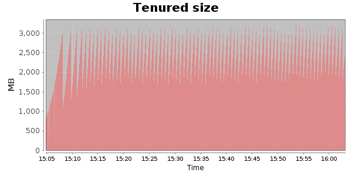
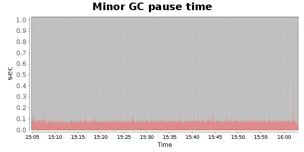
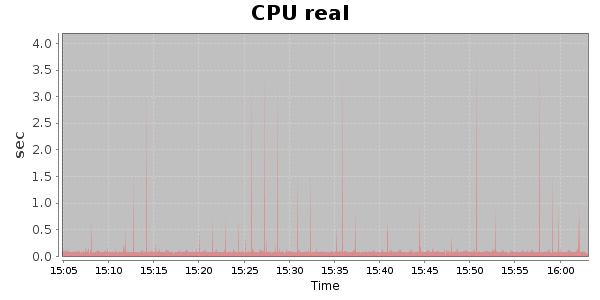
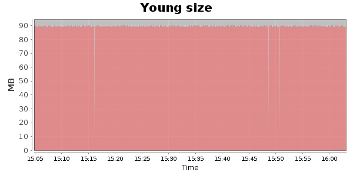

### JMeter-2.9 10000 Users
#### https://flood.io/cca530ef912308
#### Apdex 0.95 [4000]
This flood simulated up to 10,000 concurrent users for about 1 hour on  2013-10-04 15:04:00 UTC from Australia (Sydney). A mean response time of 1,705 ms was observed with a standard deviation of 15 ms. The 95th percentile was 1,715 ms and the 50th percentile (median) was 1,710 ms. A mean throughput of 1.20 Mbps was observed with a peak of 1.37 Mbps. A total of 539 MB was transferred. A total of 1,962,712 requests were successfully simulated with no errors observed. The mean request rate was 33,266.00 rpm. 

\
\
\
\
\

