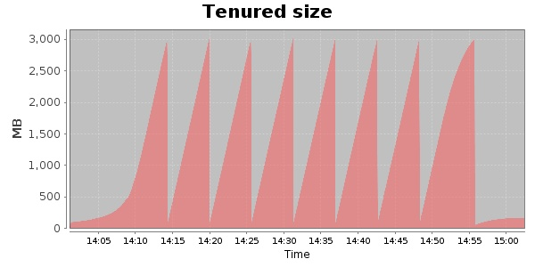
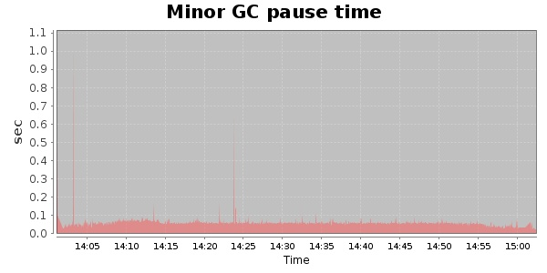
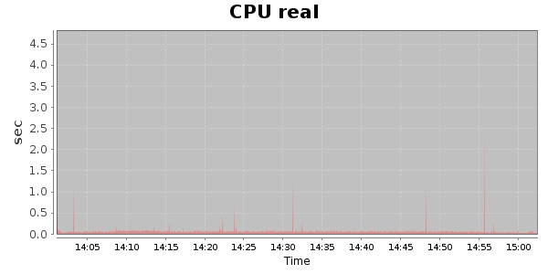
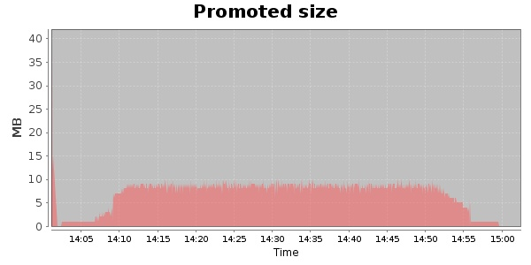
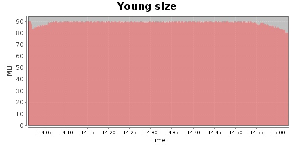

### Gatling-1.5.3 10000 Users
#### https://flood.io/cee9983bd489d1
#### Apdex 0.95 [4000]
This flood simulated up to 10,000 concurrent users for about 1 hour on  2013-10-03 14:02:00 UTC from Australia (Sydney). A mean response time of 1,708 ms was observed with a standard deviation of 11 ms. The 95th percentile was 1,728 ms and the 50th percentile (median) was 1,708 ms. A mean throughput of 208 kbps was observed with a peak of 1.32 Mbps. A total of 91.6 MB was transferred. A total of 1,798,308 requests were successfully simulated with an error rate of 0.0% observed. The mean request rate was 30,479.00 rpm. 

\
\
\
\
\

