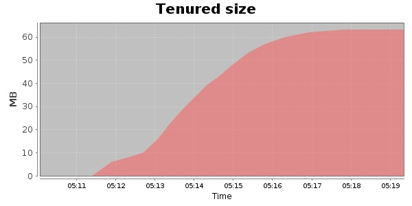
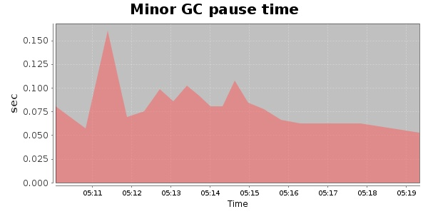
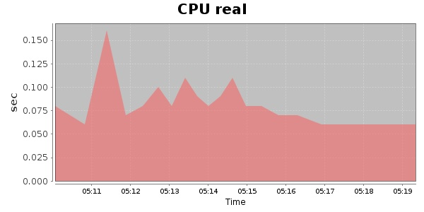
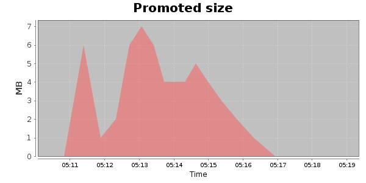
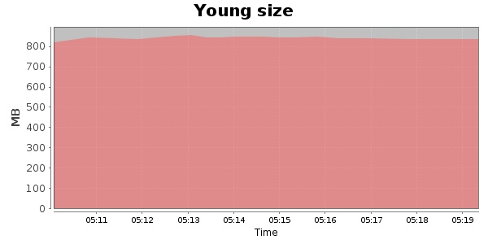

### Gatling-1.5.3 6000 Users
#### https://flood.io/d037c19c88d232
#### Apdex 0.8 [300]
This flood simulated up to 6,000 concurrent users for 9 minutes on  2013-09-30 05:09:00 UTC from Australia (Sydney). A mean response time of 304 ms was observed with a standard deviation of 6 ms. The 95th percentile was 312 ms and the 50th percentile (median) was 305 ms. A mean throughput of 5.41 Mbps was observed with a peak of 9.99 Mbps. A total of 406 MB was transferred. A total of 118,137 requests were successfully simulated with an error rate of 0.0% observed. The mean request rate was 13,126.00 rpm. 

\
\
\
\
\

