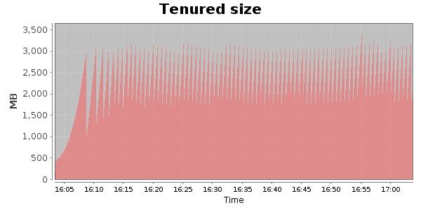
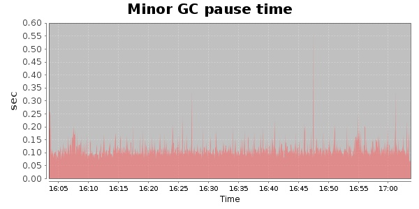
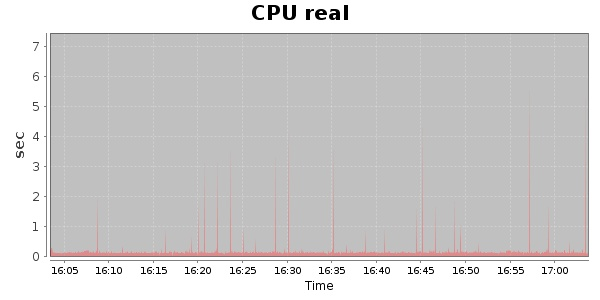
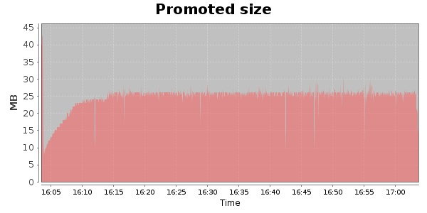
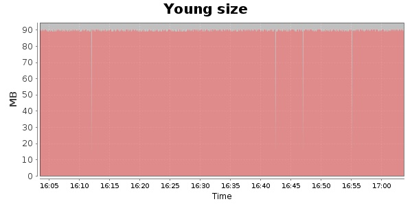

### JMeter-r1529559 10000 Users
#### https://flood.io/d363b92430e6ca
#### Apdex 0.95 [4000]
This flood simulated up to 10,000 concurrent users for about 1 hour on  2013-10-06 16:03:00 UTC from Australia (Sydney). A mean response time of 1,707 ms was observed with a standard deviation of 50 ms. The 95th percentile was 1,724 ms and the 50th percentile (median) was 1,718 ms. A mean throughput of 1.18 Mbps was observed with a peak of 1.39 Mbps. A total of 539 MB was transferred. A total of 1,956,860 requests were successfully simulated with no errors observed. The mean request rate was 32,614.00 rpm. 

\
\
\
\
\

