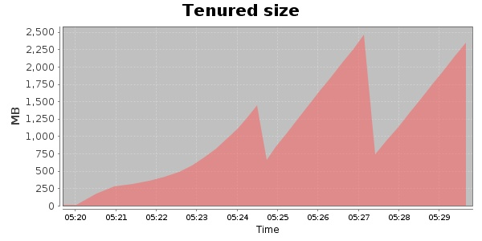
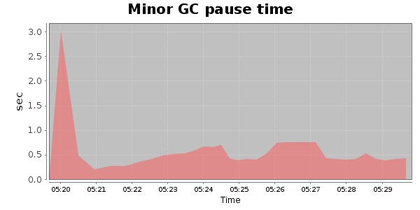
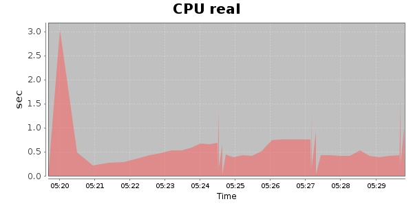
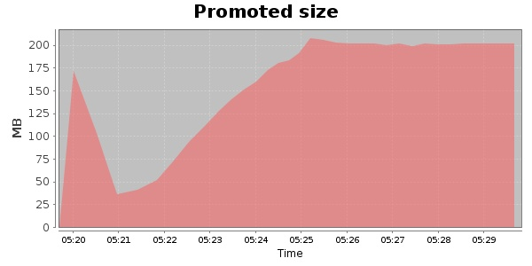
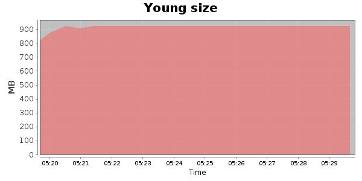

### JMeter-2.9 6000 Users
#### https://flood.io/de7b58950a1f5b
#### Apdex 0.8 [300]
This flood simulated up to 6,000 concurrent users for 10 minutes on  2013-09-30 05:19:00 UTC from Australia (Sydney). A mean response time of 313 ms was observed with a standard deviation of 11 ms. The 95th percentile was 337 ms and the 50th percentile (median) was 309 ms. A mean throughput of 1.33 Mbps was observed with a peak of 1.90 Mbps. A total of 110 MB was transferred. A total of 174,624 requests were successfully simulated with no errors observed. The mean request rate was 17,462.00 rpm. 

\
\
\
\
\

