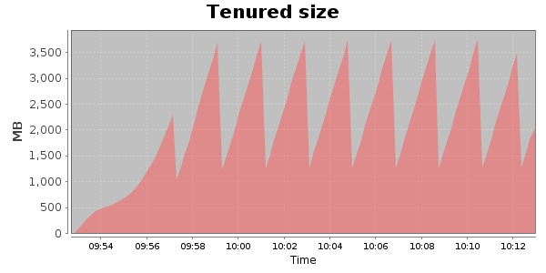
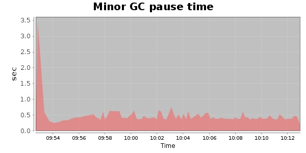
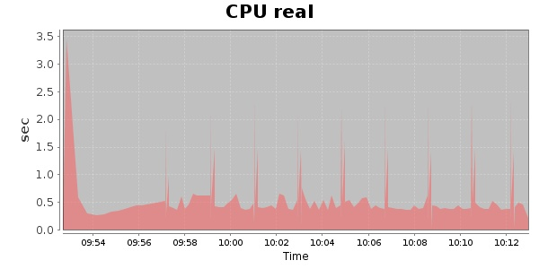
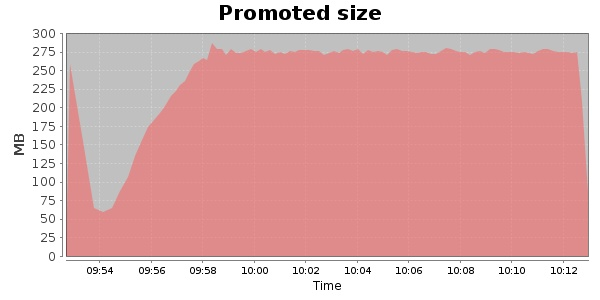
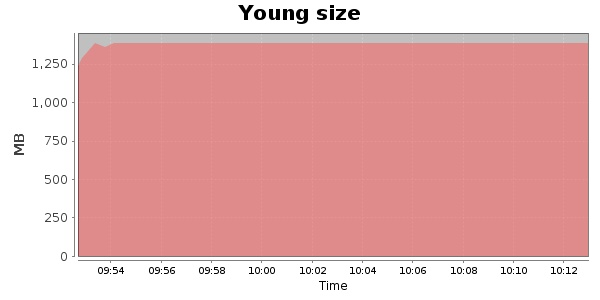

### JMeter-2.9 10000 Users
#### https://flood.io/e281b0e339fb14
#### Apdex 0.95 [4000]
This flood simulated up to 10,000 concurrent users for 20 minutes on  2013-09-30 09:52:00 UTC from Australia (Sydney). A mean response time of 1,625 ms was observed with a standard deviation of 322 ms. The 95th percentile was 1,719 ms and the 50th percentile (median) was 1,711 ms. A mean throughput of 1.14 Mbps was observed with a peak of 1.44 Mbps. A total of 180 MB was transferred. A total of 624,912 requests were successfully simulated with no errors observed. The mean request rate was 31,245.00 rpm. 

\
\
\
\
\

