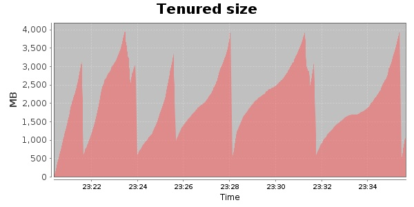
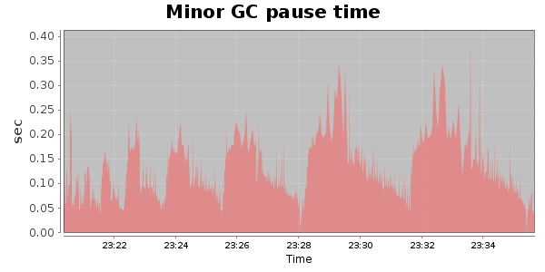
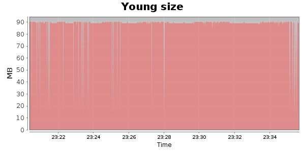

### JMeter-2.9 Kludge 30000 Users
#### https://flood.io/e48ba7b6ae3f71
#### Apdex 0.86 [4000]
This flood simulated up to 12,350 concurrent users for 15 minutes on  2013-10-05 23:20:00 UTC from Australia (Sydney). A mean response time of 2,390 ms was observed with a standard deviation of 774 ms. The 95th percentile was 5,059 ms and the 50th percentile (median) was 2,265 ms. A mean throughput of 1.01 Mbps was observed with a peak of 2.10 Mbps. A total of 121 MB was transferred. A total of 163,116 requests were successfully simulated with no errors observed. The mean request rate was 10,874.00 rpm. 

\
\
\
\
\

