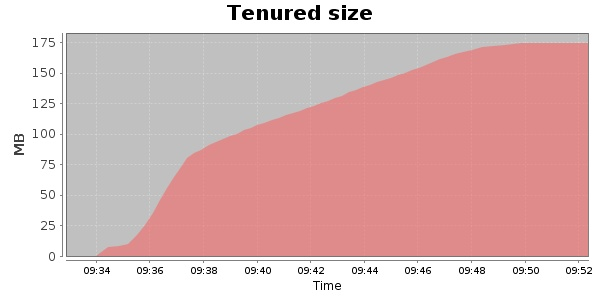
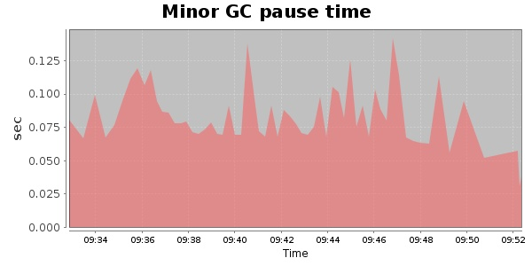
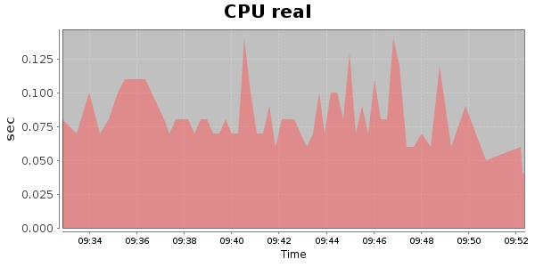
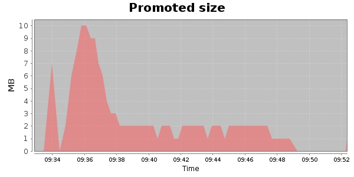
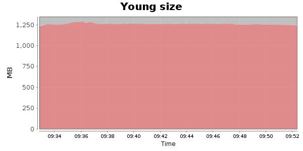

### Gatling-1.5.3 10000 Users
#### https://flood.io/e639303fb162ce
#### Apdex 0.95 [4000]
This flood simulated up to 10,000 concurrent users for 20 minutes on  2013-09-30 09:31:00 UTC from Australia (Sydney). A mean response time of 1,788 ms was observed with a standard deviation of 362 ms. The 95th percentile was 1,733 ms and the 50th percentile (median) was 1,707 ms. A mean throughput of 619 kbps was observed with a peak of 2.57 Mbps. A total of 95.1 MB was transferred. A total of 543,254 requests were successfully simulated with no errors observed. The mean request rate was 27,162.00 rpm. 

```
Total time: 19.47 min
Young size collected: 74 GB
Young size collected: 65.22 MB/s
Total size collected by minor GC: 74 GB
Total size collected by minor GC: 65.069 MB/s
Promoted size: 0 GB
Promoted size: 0.151 MB/s
Cpu Minor GC real: 0.44%
Cpu Major GC total processors: 1.46%
Cpu Major GC real: 0.0%
Cpu Major GC total processors: 0.0%
```

\
\
\
\
\

