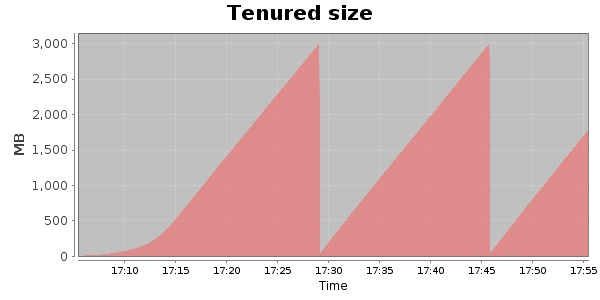
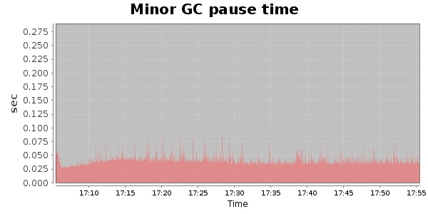
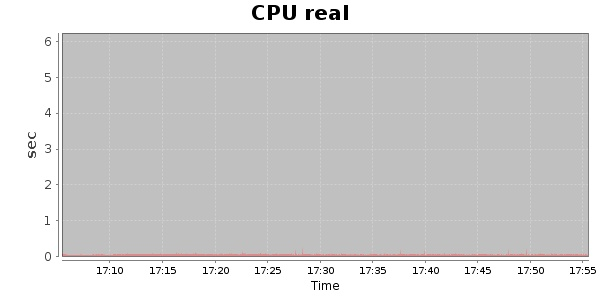
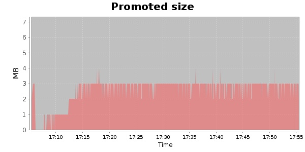
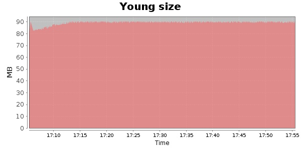

### Gatling-2.0.0-20131003.084332-335-bundle 10000 Users
#### https://flood.io/e69df113d8996f
#### Apdex 0.95 [4000]
This flood simulated up to 9,999 concurrent users for about 1 hour on  2013-10-04 17:05:00 UTC from Australia (Sydney). A mean response time of 1,705 ms was observed with a standard deviation of 20 ms. The 95th percentile was 1,732 ms and the 50th percentile (median) was 1,705 ms. A mean throughput of 260 kbps was observed with a peak of 1.33 Mbps. A total of 97.1 MB was transferred. A total of 1,616,657 requests were successfully simulated with no errors observed. The mean request rate was 32,333.00 rpm. 

\
\
\
\
\

