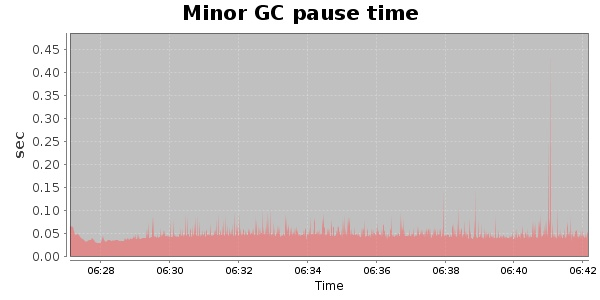
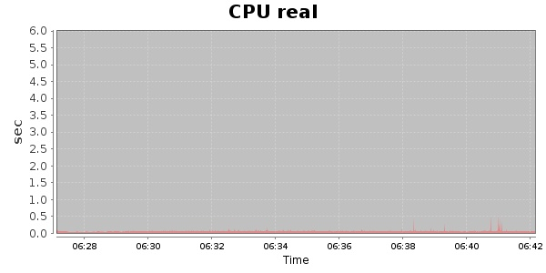
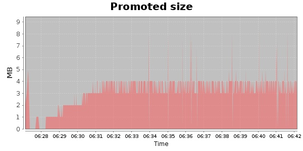
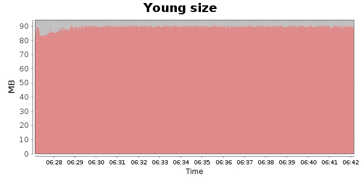

### Gatling-2.0.0-20131003.084332-335-bundle 30000 Users
#### https://flood.io/e6aa19ec83d795
#### Apdex 0.95 [4000]
This flood simulated up to 29,999 concurrent users for 14 minutes on  2013-10-04 06:28:00 UTC from Australia (Sydney). A mean response time of 1,654 ms was observed with a standard deviation of 198 ms. The 95th percentile was 1,735 ms and the 50th percentile (median) was 1,704 ms. A mean throughput of 2.34 Mbps was observed with a peak of 7.62 Mbps. A total of 263 MB was transferred. A total of 706,289 requests were successfully simulated with no errors observed. The mean request rate was 50,449.00 rpm. 

\
\
\
\
\

