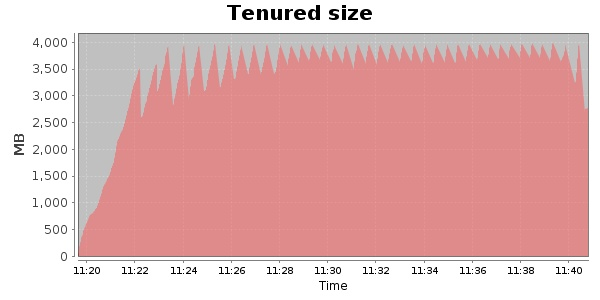
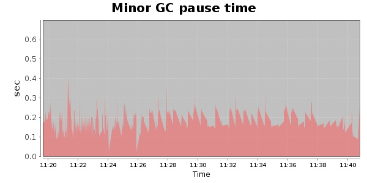
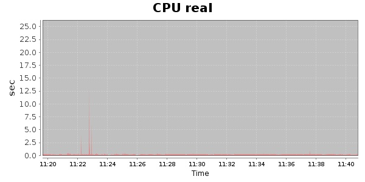
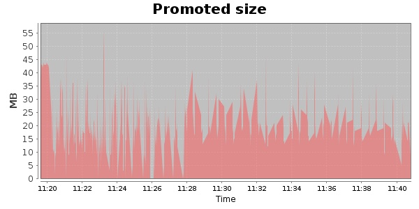
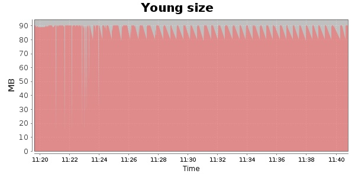

### JMeter-r1529062 30000 Users
#### https://flood.io/edbe245547dd43
#### Apdex 0.25 [4000]
This flood simulated up to 30,000 concurrent users for 19 minutes on  2013-10-04 11:20:00 UTC from Australia (Sydney). A mean response time of 40,335 ms was observed with a standard deviation of 23,613 ms. The 95th percentile was 71,410 ms and the 50th percentile (median) was 47,040 ms. A mean throughput of 630 kbps was observed with a peak of 1.41 Mbps. A total of 92.2 MB was transferred. A total of 219,372 requests were successfully simulated with no errors observed. The mean request rate was 11,545.00 rpm. 

\
\
\
\
\

