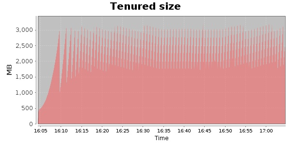
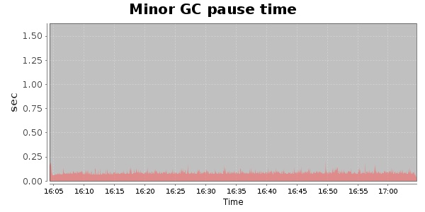
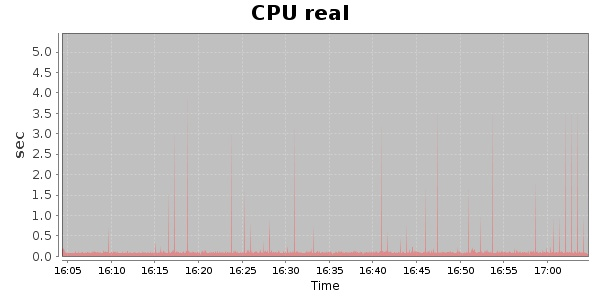
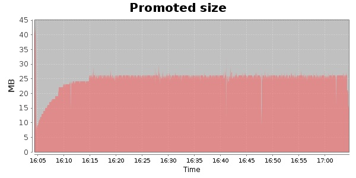
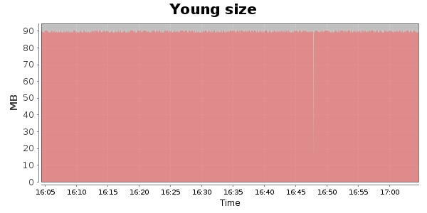

### JMeter-r1529062 10000 Users
#### https://flood.io/f4f046d210ff21
#### Apdex 0.95 [4000]
This flood simulated up to 10,000 concurrent users for about 1 hour on  2013-10-04 16:05:00 UTC from Australia (Sydney). A mean response time of 1,707 ms was observed with a standard deviation of 14 ms. The 95th percentile was 1,715 ms and the 50th percentile (median) was 1,710 ms. A mean throughput of 1.19 Mbps was observed with a peak of 1.40 Mbps. A total of 537 MB was transferred. A total of 1,950,482 requests were successfully simulated with no errors observed. The mean request rate was 33,058.00 rpm. 

\
\
\
\
\

