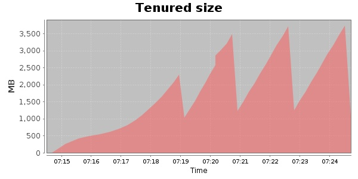
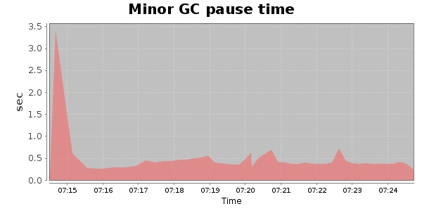
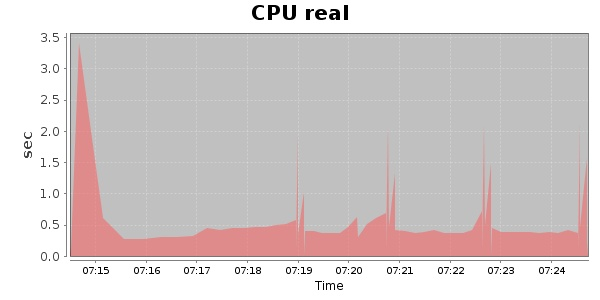
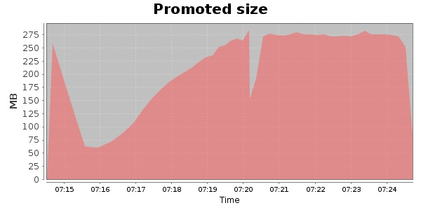
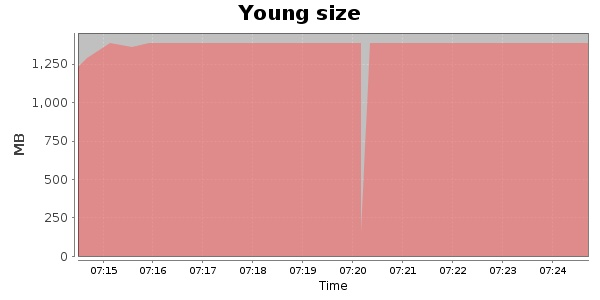

### JMeter-2.9 10000 Users
#### https://flood.io/f768902348ad34
#### Apdex 0.43 [1500]
This flood simulated up to 10,000 concurrent users for 10 minutes on  2013-09-30 07:14:00 UTC from Australia (Sydney). A mean response time of 1,630 ms was observed with a standard deviation of 176 ms. The 95th percentile was 1,728 ms and the 50th percentile (median) was 1,689 ms. A mean throughput of 1.02 Mbps was observed with a peak of 1.47 Mbps. A total of 84 MB was transferred. A total of 267,993 requests were successfully simulated with no errors observed. The mean request rate was 26,799.00 rpm. 

\
\
\
\
\

